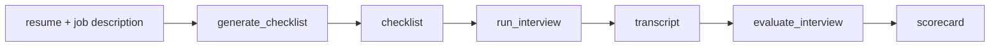

# Interview Agent

A voice agent that screens candidates. Given a resume and a job description it
builds a checklist of questions — including one problem statement drawn from
research into the company — then runs a spoken interview and scores what the
candidate said against that checklist.

LiveKit owns the voice pipeline: speech to text, turn detection, text to speech,
and the session itself. Everything in this repository is what makes it an
interview rather than a chat.



## Layout

| Path | What it is |
| --- | --- |
| `my-agent/` | The Python agent, and the API that manages candidates and interviews |
| `web/` | The browser UI: candidate list, interview review, and the call itself |

## Running it

You need [uv](https://docs.astral.sh/uv/), Node, and a [LiveKit Cloud](https://cloud.livekit.io/)
project.

```bash
cd my-agent && uv sync && cp .env.example .env.local   # then fill in LiveKit keys
cd ../web && npm install
```

Three processes, three terminals:

```bash
cd my-agent && uv run uvicorn api.app:app --port 8000   # API and store
cd my-agent && uv run python src/agent.py dev           # the interviewer
cd web && npm run dev                                   # UI on :5173
```

Then open <http://localhost:5173>, add a candidate, and create an interview.

### Resumes and job descriptions

Both are read from disk as text, relative to `DOCUMENTS_DIR` (default
`my-agent/data/documents`). A candidate's `resume_ref` and an interview's
`jd_ref` are paths under that directory, so `resumes/ada.md` and
`jd/backend-engineer.md` are what you type into the forms. Nothing parses PDFs,
and a reference that climbs out of the directory is refused.

Creating an interview returns immediately with status `preparing`. Checklist
generation runs in the background and the interview only reaches `ready` once
the checklist is stored, so a session can never start against half a checklist.
The interview screen polls itself while that happens.

### Environment

| Variable | Required | Notes |
| --- | --- | --- |
| `LIVEKIT_URL` | yes | |
| `LIVEKIT_API_KEY` | yes | Also used by LiveKit Inference, so the backend needs no separate model key. |
| `LIVEKIT_API_SECRET` | yes | |
| `TAVILY_API_KEY` | no | Without it, company research is skipped and the problem statement is written from the job description alone. |
| `DATABASE_URL` | no | Defaults to `sqlite:///data/interview.db`. |
| `DOCUMENTS_DIR` | no | Defaults to `data/documents`. |
| `SESSION_BUDGET_S` | no | Defaults to 300. The interview is sized to this and closed at it. |
| `WORKFLOW_MODEL` | no | Defaults to `google/gemini-2.5-flash`, used for the checklist and the scorecard. |

## Tests

```bash
cd my-agent && uv run pytest      # 244 tests, no network needed
cd web && npm run build && npm run lint
```

## How an interview runs

An interview moves through five states, and a session that dies mid-way still
reaches `completed` so it can be scored:

```text
created → preparing → ready → in_progress → completed
```

During the call the agent works from the checklist as a pool rather than a
script: it picks what matters given what the candidate has said, and reports
each question closed through a tool. The session ends when the checklist runs
out or the time budget does, whichever comes first. Scoring is a separate,
stateless pass over the finished transcript, and it is idempotent, so a
retry cannot double-score anything.

## What is not built

- **Retry on a failed checklist job.** A failure leaves the interview in
  `preparing` with a logged error; nothing retries it and nothing surfaces it.
- **Authentication, and any answer to what a candidate may see.** The recruiter
  views and the call page are one app. Anyone holding an interview id can open
  it. The only separation that exists is that the call page never shows a score.
- **Scoring metrics and weighting.** The rubric prompt exists; there is no
  aggregate score.
- **Retry for scoring.** It is safe to retry, but nothing does.
- **Simulation scenarios.** `my-agent/scenarios.yaml` describes the interviewer
  but cannot run yet: simulations need a room named `interview-<id>` with a
  ready checklist, and nothing seeds that.
- **Frontend tests.** The build, the typecheck, and the lint are the coverage.
